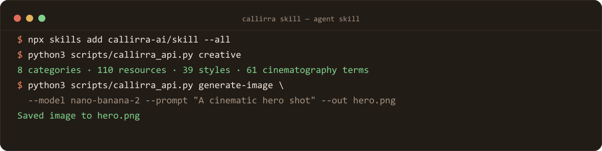
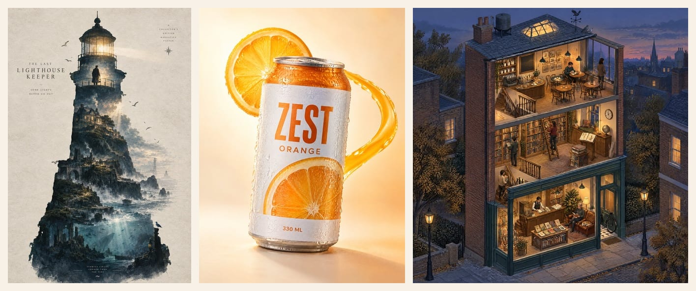

# Callirra Media Generator Skill

> ⚠️ **The built-in template catalogue was retired (Sep 2026)**: `PROMPT_TEMPLATES` is now an empty array,
> `GET /api/v1/prompts/templates` returns an empty list, and any `templateId` call returns 404. References to
> built-in templates or `--template-id` below are historical — use the prompt box or `prompts/enhance` instead.

[](#install)
[](#requirements)
[](#license)

An open-source AI agent skill for generating and monitoring Callirra image and video tasks.






Works with Claude Code, Codex, Cursor and other skill-enabled AI coding platforms.

## Requirements

- Python 3.10+
- A Callirra API key (`sk-cal-...`)

## Install

Install the skill into your agent runtime:

```bash
npx skills add callirra-ai/skill --all
```

Then save your API key once:

```bash
python3 scripts/callirra_api.py setup-api-key "<your-api-key>"
```

Get a key at [callirra.com](https://callirra.com?utm_source=github-skill).

## Commands

```bash
# Account
python3 scripts/callirra_api.py balance
python3 scripts/callirra_api.py usage --limit 10

# Models
python3 scripts/callirra_api.py models

# Templates & knowledge
python3 scripts/callirra_api.py templates
python3 scripts/callirra_api.py enhance \
  --template-id cinematic-city \
  --idea "A rainy Tokyo street at night" \
  --kind video

# Creative knowledge (add --full to print the whole JSON)
python3 scripts/callirra_api.py creative
python3 scripts/callirra_api.py creative --full

# Generate
python3 scripts/callirra_api.py generate-image \
  --model nano-banana-2 \
  --prompt "A cinematic hero shot" \
  --size 1024x1024 \
  --out hero.png

python3 scripts/callirra_api.py generate-video \
  --model seedance-2.5 \
  --prompt "A drone shot over mountains" \
  --duration 10 \
  --resolution 720p \
  --wait \
  --out clip.mp4

# Task management
python3 scripts/callirra_api.py task <TASK_ID>
python3 scripts/callirra_api.py cancel <TASK_ID>

# Upload reference image
python3 scripts/callirra_api.py upload --file ./frame.png --content-type image/png
```

## Content

- `SKILL.md` — main skill instructions
- `scripts/callirra_api.py` — zero-dependency Python CLI
- `references/callirra-api-reference.md` — API reference
- `references/creative-knowledge.json` — full curated creative knowledge base (110 resources, 8 categories, 39 styles, 61 cinematography terms)
- `workflows/` — reusable recipe workflows

## Related

- [GPT Image 2.5 Prompt Atlas](https://github.com/callirra-ai/gpt-image-2-5-prompt-atlas) — 50 prompts, each shipped with the exact frame it produced, plus a measured Flare-vs-Sunburst comparison
- [CLI](https://github.com/callirra-ai/cli?utm_source=github-skill) · [MCP server](https://github.com/callirra-ai/mcp?utm_source=github-skill) — the same catalogue for terminals and MCP-compatible agents

## License

MIT. Source: [github.com/callirra-ai/skill](https://github.com/callirra-ai/skill?utm_source=github-skill)

---

Start free at [callirra.com](https://callirra.com?utm_source=github-skill)